# aws-workshop
This #aws #redshift workshop is about streaming data into Redshift using Binance API:
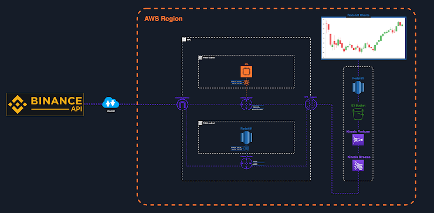

Let's do this together now:
# Create a VPC
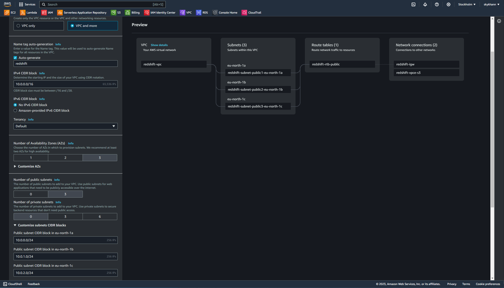

# Create an s3 bucket
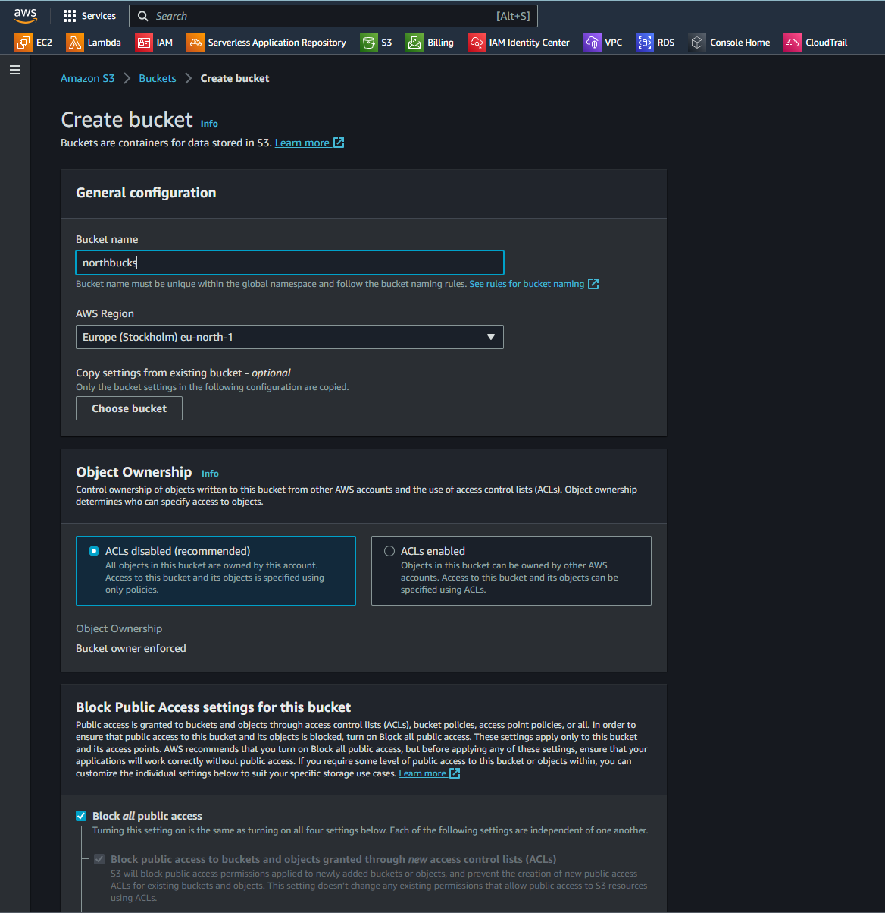

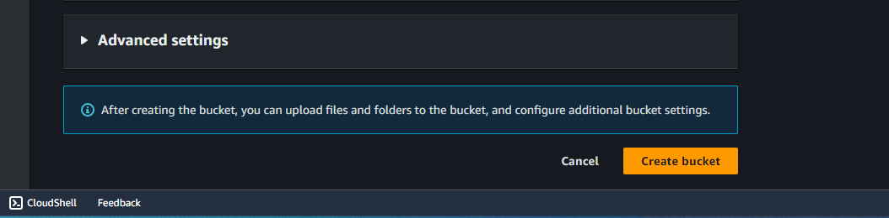

# Create Role for EC2 to Kinesis Access
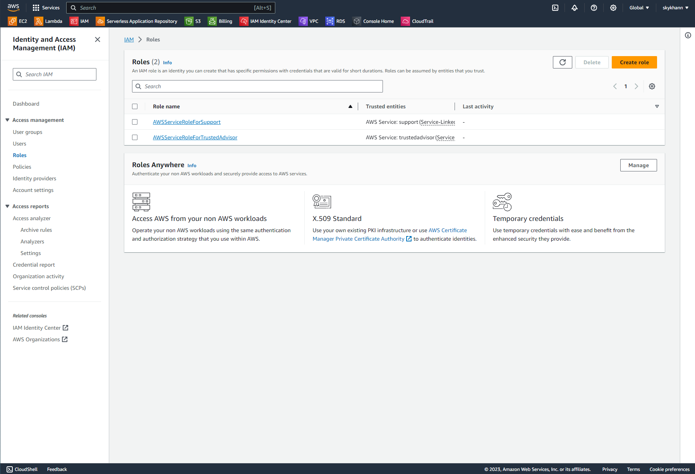

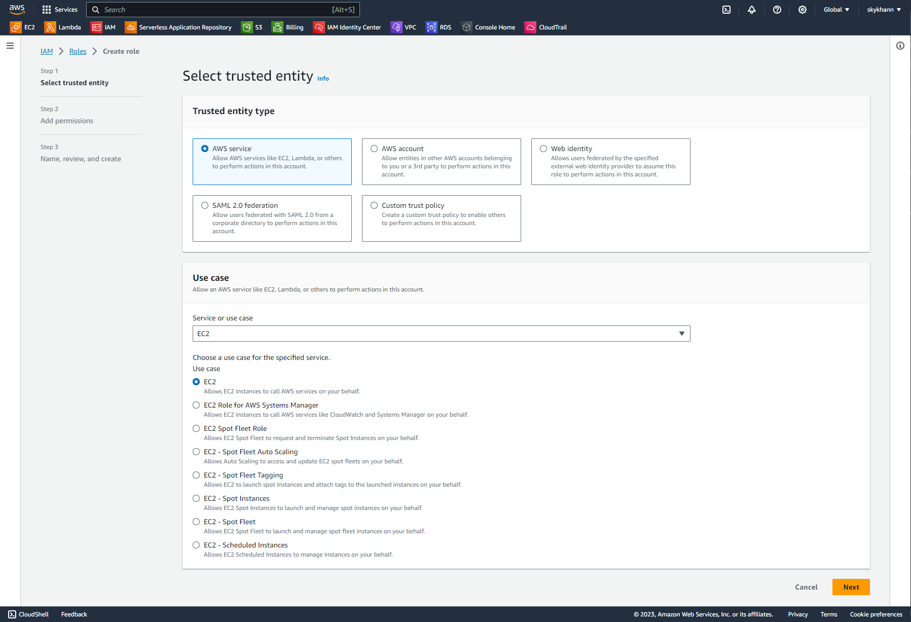

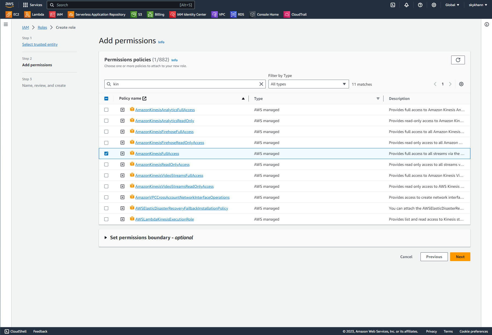

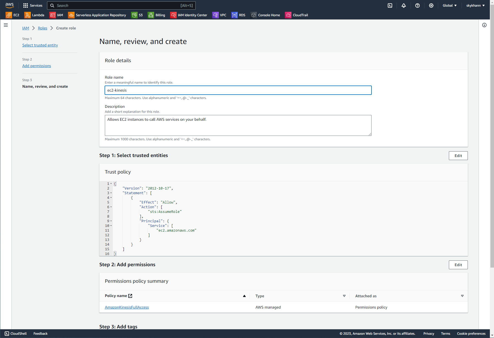

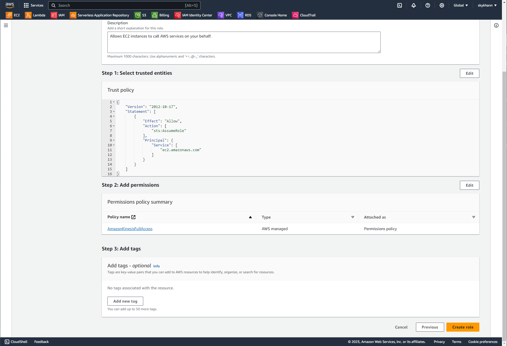

# Create a Kinesis Data Stream
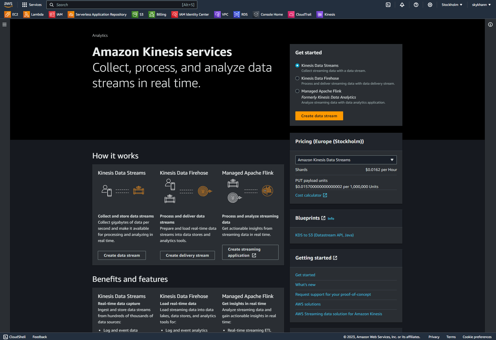

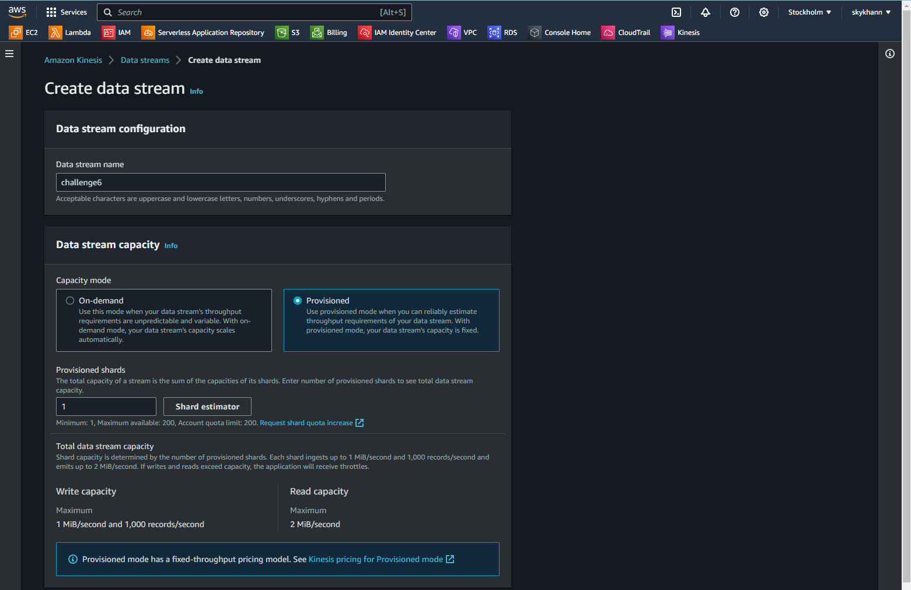

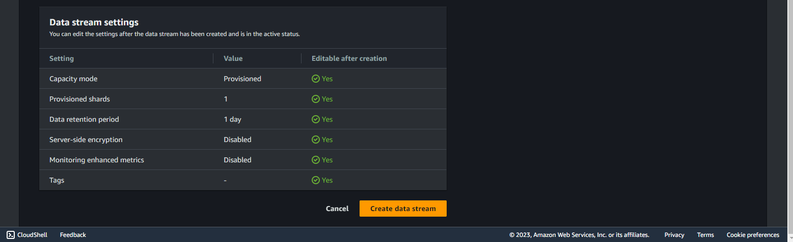

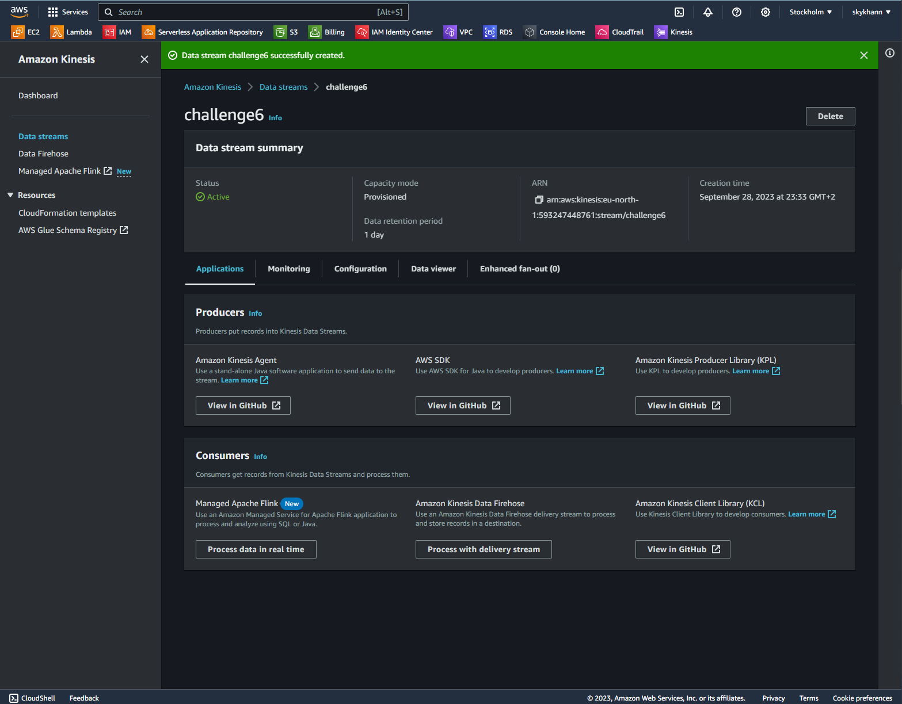

