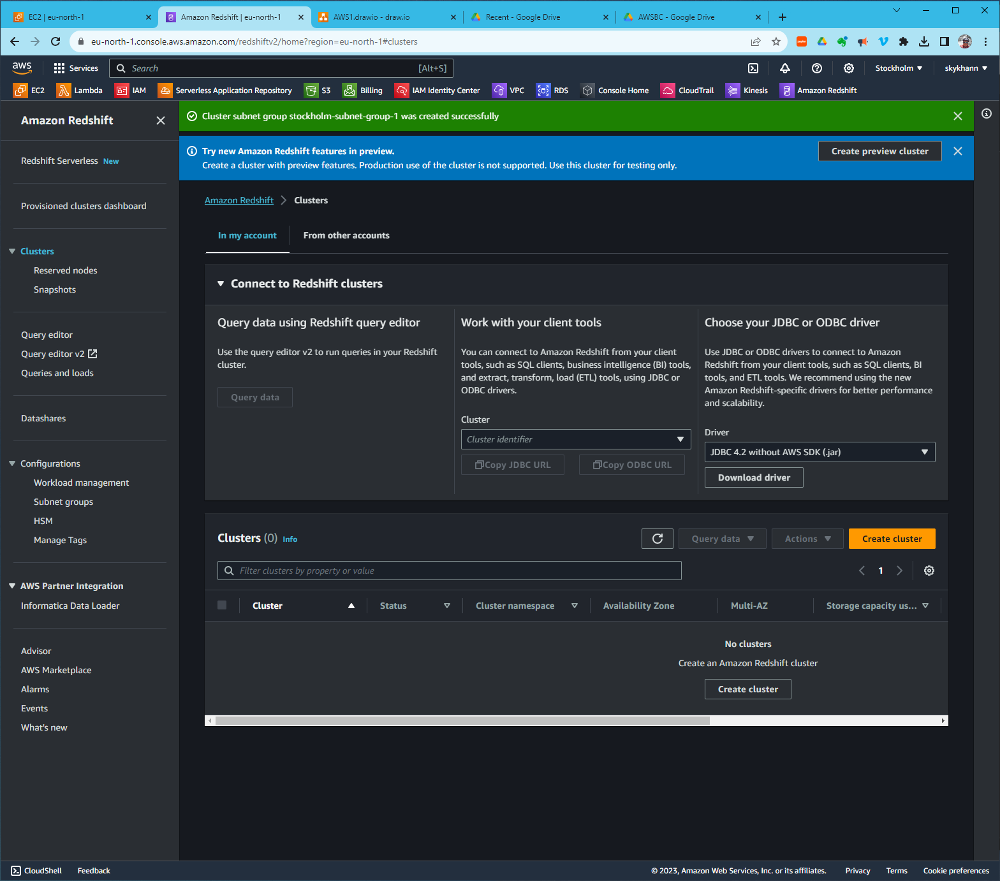

# aws-workshop
This #aws #redshift workshop is about streaming data into Redshift using Binance API:

Amazon Redshift is a popular cloud-based data warehousing service offered by Amazon Web Services (AWS). It is designed for large-scale data warehousing and analytics and offers several benefits and common use cases:

### Benefits of AWS Redshift:

**High Performance:** Redshift is optimized for query performance on large datasets. It uses columnar storage, parallel processing, and compression techniques to deliver fast query results, even on terabytes of data.

**Scalability:** Redshift can easily scale to accommodate growing data needs. You can add or remove nodes to the Redshift cluster as required, allowing your data warehouse to grow with your organization.

**Ease of Use:** It offers a familiar SQL interface, making it easier for data analysts and SQL developers to work with. Additionally, it integrates with popular BI (Business Intelligence) tools and data visualization platforms.

**Data Integration:** Redshift can integrate with various AWS services and other data sources, making it easier to consolidate data from multiple sources into a single data warehouse.

**Security:** AWS provides robust security features, including encryption at rest and in transit, identity and access management (IAM), and VPC (Virtual Private Cloud) isolation to protect your data.

**Cost Efficiency:** Redshift offers cost-effective pricing models, including pay-as-you-go and reserved instance options, allowing you to control and optimize your data warehousing costs.

### Common Use Cases for AWS Redshift:

**Data Warehousing:** Redshift is primarily used as a data warehouse to store and analyze large volumes of structured data. Organizations can consolidate data from various sources, clean and transform it, and make it available for analysis.

**Business Intelligence (BI):** Redshift integrates seamlessly with BI tools like Tableau, Looker, and Power BI. Analysts can run complex queries and generate reports and dashboards to gain insights into business performance.

**Log Analysis:** It can be used to analyze log data generated by applications and systems. Redshift can process and analyze massive amounts of log data to identify trends, anomalies, and troubleshoot issues.

**E-commerce Analytics:** Online retailers use Redshift to analyze customer behavior, track sales trends, and optimize product recommendations based on historical data.

**Financial Analysis:** Financial institutions leverage Redshift for fraud detection, risk analysis, and compliance reporting by analyzing large volumes of transaction data.

**IoT Data Processing:** Internet of Things (IoT) devices generate vast amounts of data. Redshift can handle IoT data streams, enabling real-time and historical analysis for decision-making.

**Clickstream Analysis:** Online businesses use Redshift to analyze user interactions on their websites or mobile apps to enhance user experience and marketing strategies.

**Predictive Analytics:** Redshift can be used in conjunction with machine learning frameworks to build predictive models using historical data.

**Data Archiving and Backup:** It can serve as a cost-effective storage solution for archiving historical data that may need to be accessed occasionally.

**Healthcare Analytics:** Healthcare organizations use Redshift to analyze patient data, improve care outcomes, and streamline operations.

AWS Redshift's scalability, performance, and integration capabilities make it a versatile choice for organizations looking to harness the power of data analytics and make data-driven decisions across various industries and use cases.

Let's do this together now:
# Create a VPC

# Create an s3 bucket

# Create Role for EC2 to Kinesis Access

# Create a Kinesis Data Stream

# Bring Up an EC2 Instance

# Redshift Cluster Preparations

# Allocate an Elastic IP

# Bring Up a Redshift Cluster

# Connecting from DataGrip to Redshift

# Setting Up Kinesis Firehose

# Redshift Query Editor - Visualizing the Data

