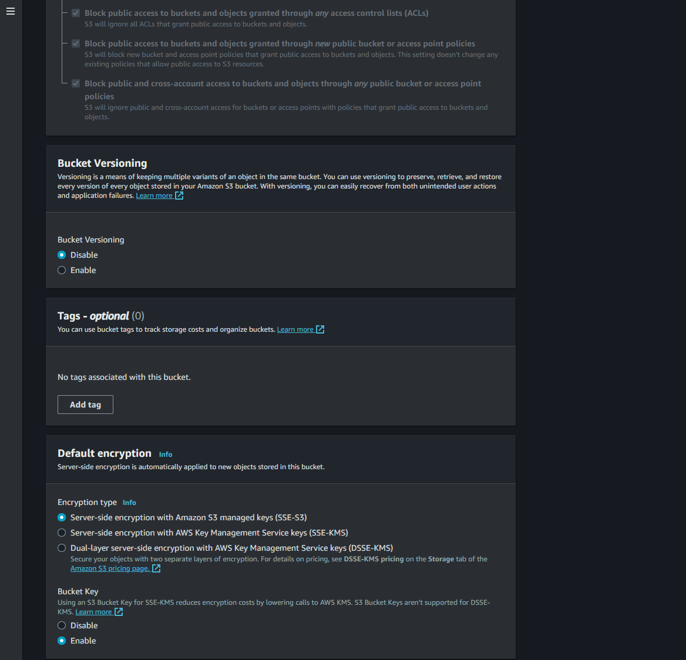
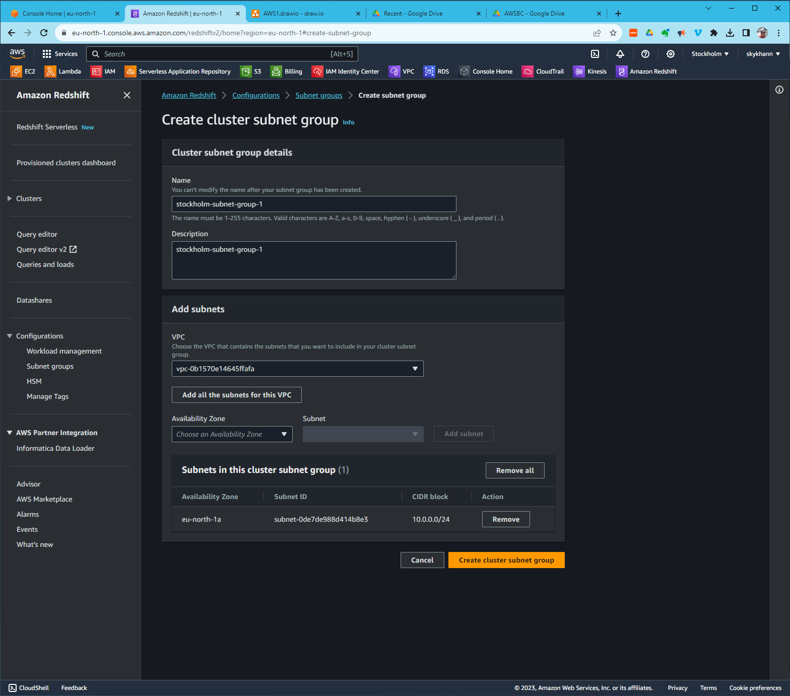

# aws-workshop
This #aws #redshift workshop is about streaming data into Redshift using Binance API:

Let's do this together now:
# Create a VPC

# Create an s3 bucket

# Create Role for EC2 to Kinesis Access

# Create a Kinesis Data Stream

# Bring Up an EC2 Instance

# Redshift Cluster Preparations

# Allocate an Elastic IP

# Bring Up a Redshift Cluster

# Connecting from DataGrip to Redshift

# Setting Up Kinesis Firehose

# Redshift Query Editor - Visualizing the Data

